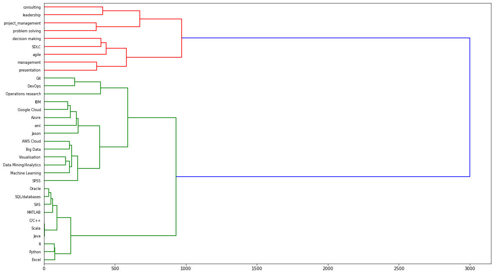

# Job-positions-Scrapping
In this project we loop over 1000+ web-pages with job positions advertised on that web-site and parsed HTML pages with "data scientist" job titles
to extract position title, employer, location, salary, and software/programming skills.

We performed **hierarchical clustering of skills** on web-scraping results.

## Insights from clustring

- Skills that co-occur in multiple job postings end up in the same cluster
- As the frequency of co-occurrences of a pair of skills increases, the clusters in which skills are assigned become closer

## Prgramming Skills in-demand

## Business Skills in-demand

## Jobs with same in-demand

